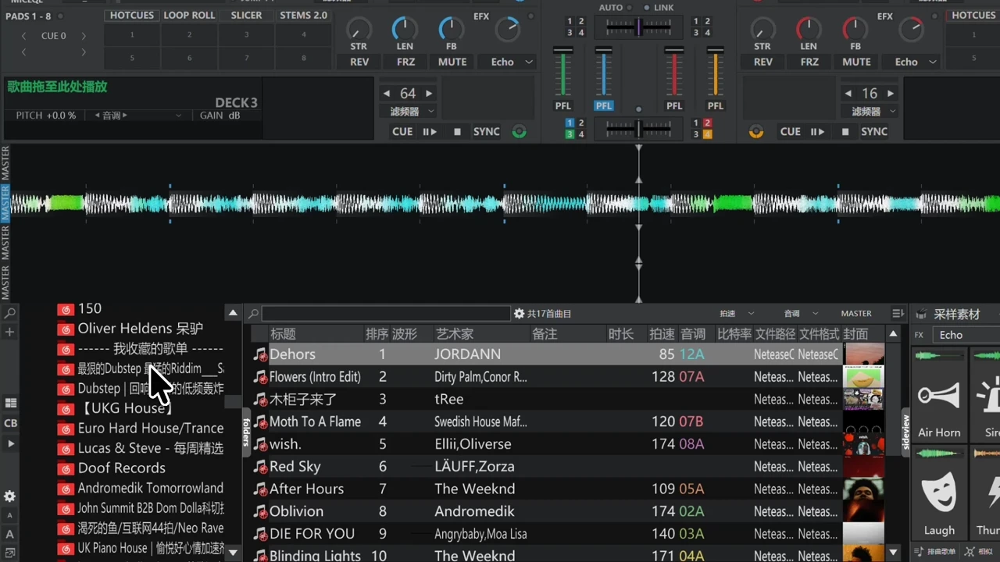
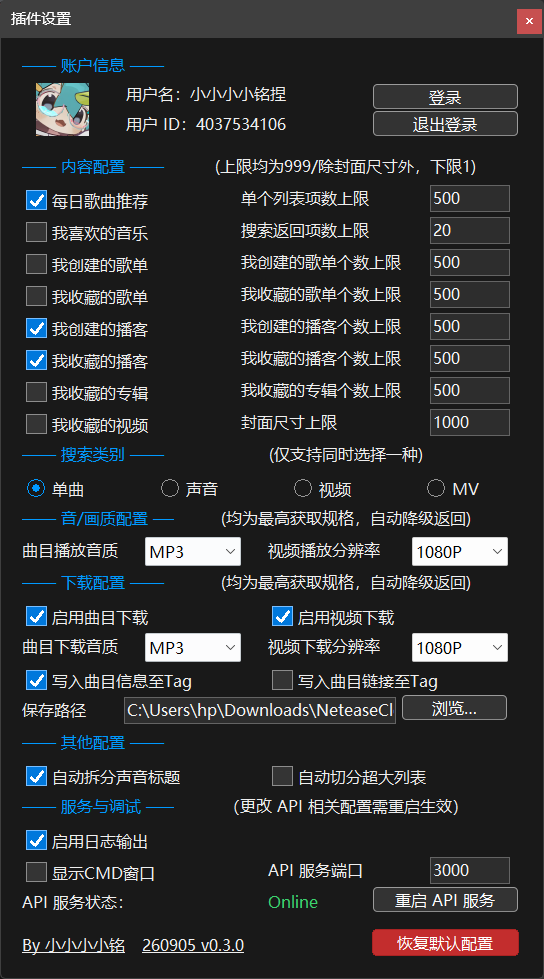

<p align="center">
	
</p>

<p align="center">
	<b style="font-size: 1.4em">NCM-Online-Source-Plugin-for-VirtualDJ</b>
</p>

<p align="center">
	<a href="https://github.com/SmallM1NG/NCM-Online-Source-Plugin-for-VirtualDJ/releases/latest"></a>
	
	
	<a href="https://cn.virtualdj.com/"></a>
	<a href="LICENSE"></a>
	<a href="https://github.com/SmallM1NG/NCM-Online-Source-Plugin-for-VirtualDJ/stargazers"></a>
</p>
<p align="center">
	<a href="#项目介绍">项目介绍</a>
	·
	<a href="#功能展示">功能展示</a>
	·
	<a href="#如何安装">如何安装</a>
	·
	<a href="#其他内容">其他内容</a>
</p>
<p align="center">
	<a href="docs/md/SETTINGS.md">配置项详细说明</a>
	·
	<a href="docs/md/FAQ.md">FAQ</a>
	·
	<a href="docs/md/HOW-IT-WORKS.md">如何工作</a>
	·
	<a href="docs/md/DEVELOPMENT.md">开发相关</a>
</p>

---

<a id="项目介绍"></a>
## 项目介绍

NCM OSP 是一款可以让 **VirtualDJ** 使用 **网易云音乐** 作为 **Online Sources（在线源）** 的插件  
用户可以在 VirtualDJ 中在线播放网易云音乐内的曲目 / 视频

支持获取并作为列表展示用户的日推、喜欢、创建 / 收藏的歌单、创建 / 收藏的播客、收藏的专辑、视频  
支持搜索，可被 VirtualDJ 中相关功能调用，例如 AI 提示 / 套曲推荐等  
支持下载音频 / 视频至本地  
内置插件设置面板，拥有丰富的可配置项

> 使用本项目时请务必遵守相关法律法规，尊重网易云音乐的服务条款


<a id="功能展示"></a>
## 功能展示 ✨

### 在线播放音频 / 视频

<div align="center">
	
</div>

### 歌单以列表展示

<div align="center">
	
</div>

### 手动搜索

<div align="center">
	
</div>

### AI 推荐等功能调用

<div align="center">
	
</div>

### 下载音频 / 视频

<div align="center">
	
</div>

### 设置面板

<div align="center">
	
	
</div>

<a id="如何安装"></a>
## 如何安装 📥

### 环境

- Windows x64
- [VirtualDJ](https://cn.virtualdj.com/) **Pro**（Online Sources 需要 Pro 授权）
- 推荐 VirtualDJ 2025

### 发行包安装

1. 到 [Releases](https://github.com/SmallM1NG/NCM-Online-Source-Plugin-for-VirtualDJ/releases/latest) 下载最新包
2. 解压后把这些文件放到同一目录：

```
VirtualDJ\Plugins64\OnlineSources\
├─ NeteaseCloudMusic.dll
├─ ncm_api_server.exe
└─ （首次运行后自动生成）
    ├─ settings.json
    ├─ ncm_user_data.json
    ├─ ncm_user_avatar.jpg
    └─ log.log
```

常见插件目录：

- `%LOCALAPPDATA%\VirtualDJ\Plugins64\OnlineSources`
- 或非系统盘 `X:\VirtualDJ\Plugins64\OnlineSources`

3. 启动 VirtualDJ，展开 **Online Sources → NeteaseCloudMusic**
4. 打开插件设置，点 **登录**，用网易云 App 扫码
5. 在搜索齿轮里勾选 **NeteaseCloudMusic**，即可搜索

升级时请先退出 VirtualDJ，覆盖 `dll` 与 `ncm_api_server.exe`。`settings.json` 与登录数据可保留；若行为异常，再删掉它们重新登录。

### 从源码编译

仓库：[SmallM1NG/NCM-Online-Source-Plugin-for-VirtualDJ](https://github.com/SmallM1NG/NCM-Online-Source-Plugin-for-VirtualDJ)

```
├─ VirtualDJ_OnlineSource.slnx        Visual Studio 解决方案
├─ Plugin/NeteaseCloudMusic/          当前插件源码 260905 v0.3.0
├─ API Server/api-enhanced/           对 api-enhanced 的 VirtualDJ 补丁（不是完整上游仓库）
├─ docs/
│  ├─ imgs/                           README 配图
│  └─ md/                             独立说明文档
└─ Legacy/
   ├─ v0.1.0/                         260331 v0.1
   └─ v0.2.0/                         260420 v0.2
```

- Visual Studio 2022 / 2026，工具集 `v145`，C++20
- 配置 `Release | x64`
- 静态链接：libcurl、jsoncpp、TagLib、zlib
- 系统库：`ws2_32` `crypt32` `dwmapi` `uxtheme` `windowscodecs` 等
- 输出为 `NeteaseCloudMusic.dll`，导出 `DllGetClassObject`

API 侧请先使用 [NeteaseCloudMusicAPI Enhanced](https://github.com/neteasecloudmusicapienhanced/api-enhanced)，再按 [`API Server/README.md`](API%20Server/README.md) 覆盖本仓库中的修改文件。历史发行版源码在 [`Legacy/v0.1.0`](Legacy/v0.1.0) 与 [`Legacy/v0.2.0`](Legacy/v0.2.0)。

<a id="其他内容"></a>
## 其他内容 📚

配置、问答、原理和开发说明见下方独立文档：

- [配置项详细说明](docs/md/SETTINGS.md)
- [FAQ](docs/md/FAQ.md)
- [如何工作](docs/md/HOW-IT-WORKS.md)
- [开发相关](docs/md/DEVELOPMENT.md)

### Architecture 🧩

```
VirtualDJ
   │  IVdjPluginOnlineSource
   ▼
NeteaseCloudMusic.dll          Win32 深色设置窗 / 扫码登录 / 搜索 / 直链 / 下载
   │  http://127.0.0.1:{port}
   ▼
ncm_api_server.exe             NeteaseCloudMusicAPI Enhanced
   │  Job Object（VDJ 退出即杀）
   ▼
网易云音乐
```

插件加载时 `CreateProcess` 拉起 API，并把子进程放进 `KILL_ON_JOB_CLOSE` 作业对象；`Release()` 或 VirtualDJ 异常退出时，API 都不会残留。状态栏的 Online / Offline 只看进程是否还活着，不会拿 `/login/status` 轮询刷日志。

### Contributing 💖

欢迎 Issue、讨论和 Pull Request。反馈可走：

- [GitHub Issues](https://github.com/SmallM1NG/NCM-Online-Source-Plugin-for-VirtualDJ/issues)
- [Bilibili](https://space.bilibili.com/475951038)

请附上 `log.log`、VirtualDJ 版本、Windows 版本和复现步骤。不要在 Issue 里贴完整 Cookie。

## Credits 🙌

- [小小小小铭 / DJM1NG](https://space.bilibili.com/475951038) — 作者
- [NeteaseCloudMusicAPI Enhanced](https://github.com/neteasecloudmusicapienhanced/api-enhanced) — 本地 API
- [VirtualDJ Plugin SDK](https://cn.virtualdj.com/wiki/Developers.html) — Online Source 接口
- 所有提出问题和试用的用户

### Dependencies

- [libcurl](https://curl.se/libcurl/)
- [JsonCpp](https://github.com/open-source-parsers/jsoncpp)
- [TagLib](https://taglib.org/)（MP3 ID3v2 / FLAC Picture）
- [zlib](https://zlib.net/)
- Windows：Win32、DWM Dark Mode、WIC、Job Object

## Legacy 🗃️

- [`Legacy/v0.1.0`](Legacy/v0.1.0)：260331 v0.1
- [`Legacy/v0.2.0`](Legacy/v0.2.0)：260420 v0.2（独立 Python / PySide6 控制面板 + C++ 插件）

那两版都需要先开控制面板再启动 VirtualDJ。当前 v0.3.0 已把登录、设置和 API 生命周期收进 DLL。

## License 📄

[GNU General Public License v3.0](LICENSE)

---

<p align="center">
	<a href="https://github.com/SmallM1NG/NCM-Online-Source-Plugin-for-VirtualDJ">GitHub</a>
	·
	<a href="https://space.bilibili.com/475951038">Bilibili</a>
	·
	<a href="https://cn.virtualdj.com/">VirtualDJ</a>
</p>
