

	

	<b style="font-size: 1.4em">NCM-Online-Source-Plugin-for-VirtualDJ</b>

	
	
	
	
	
	

	<a href="#项目介绍">项目介绍</a>
	·
	<a href="#功能展示">功能展示</a>
	·
	<a href="#如何安装">如何安装</a>
	·
	<a href="#如何使用">如何使用</a>
	·
	<a href="#其他内容">其他内容</a>

	<a href="Docs/md/SETTINGS.md">配置项详细说明</a>
	·
	<a href="Docs/md/FAQ.md">FAQ</a>
	·
	<a href="Docs/md/DEVELOPMENT.md">开发相关</a>

---

## 项目介绍 ℹ️

NCM OSP 是一款可以让 **VirtualDJ** 使用 **网易云音乐** 作为 **Online Sources（在线源）** 的插件  
用户可以在 VirtualDJ 中在线播放网易云音乐内的曲目 / 视频

支持获取并作为列表展示用户的 **日推、喜欢、创建 / 收藏的歌单、创建 / 收藏的播客、收藏的专辑、视频**  
支持 **搜索**，可被 VirtualDJ 中相关功能调用，例如 **AI 提示 / 套曲推荐** 等  
支持 **下载** 音频 / 视频至本地  
内置 **插件设置面板**，拥有丰富的可配置项

> 使用本项目时请务必遵守相关法律法规，尊重网易云音乐的服务条款

> 使用过程中产生的任何问题均与作者无关，请自行承担风险

> 本项目以 [GPLv3](LICENSE) 开源，使用、修改或分发时请遵守该协议

---

## 功能展示 ✨

### 在线播放音频 / 视频

	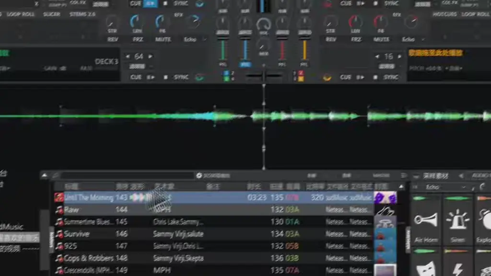

### 歌单以列表展示

	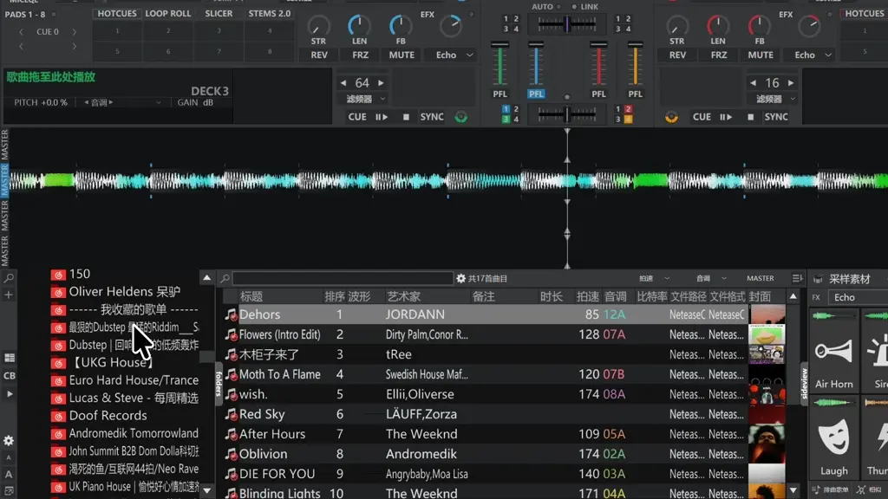

### 手动搜索

	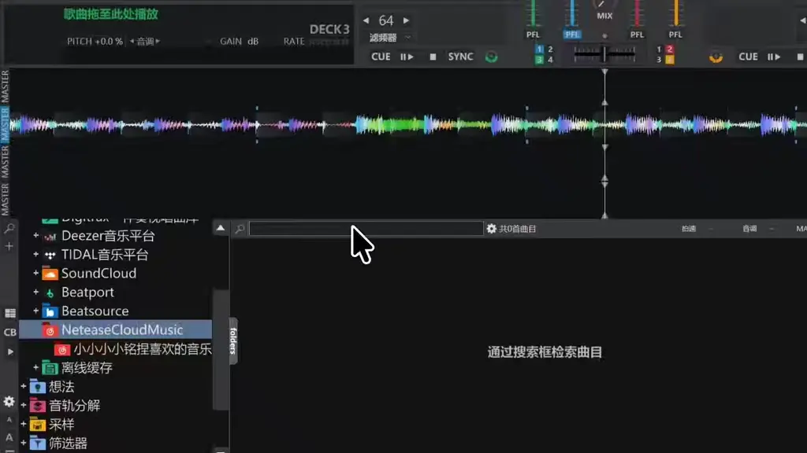

### AI 推荐等功能调用

	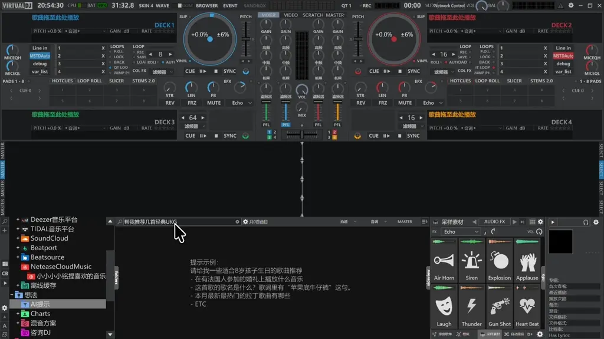

### 下载音频 / 视频

	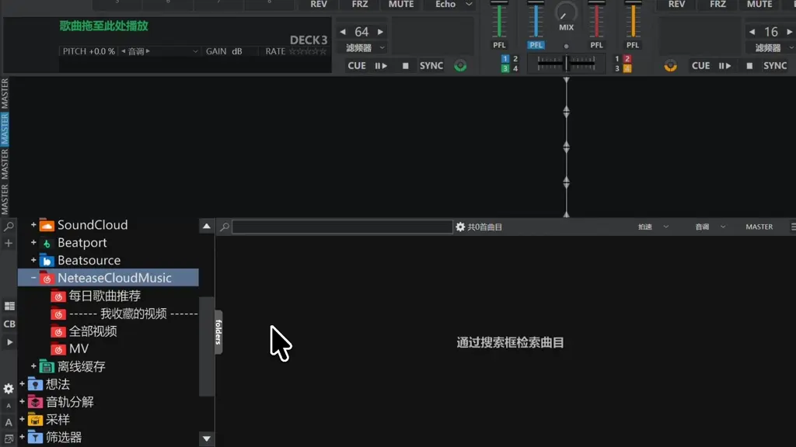

### 设置面板

	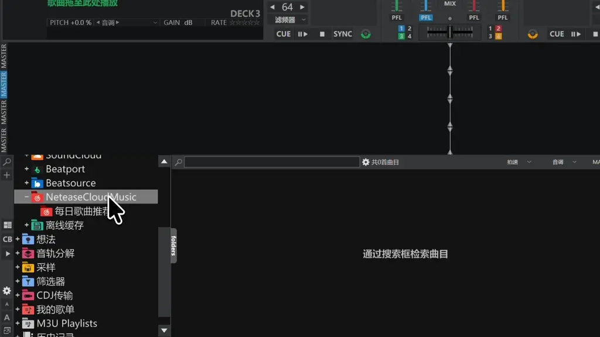

---

## 如何安装 📥

本插件仅支持 **Windows x64** 版本的 VirtualDJ，需拥有 **VirtualDJ Pro** 许可证才可使用（这是 VirtualDJ 的硬性要求）  
获取对应音质 / 内容时需拥有网易云对应等级的 **VIP**，本插件不提供任何免费获取或绕过途径

<ol>
<li>

从 [Releases](https://github.com/SmallM1NG/NCM-Online-Source-Plugin-for-VirtualDJ/releases/latest) 下载最新版本发行包（当前为 [v0.3.0](https://github.com/SmallM1NG/NCM-Online-Source-Plugin-for-VirtualDJ/releases/tag/v0.3.0)）

</li>
<li>

完全解压压缩包内的内容，应包含一个 **exe** 和一个 **dll** 文件

	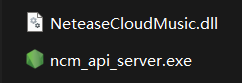

</li>
<li>

将两个文件放入 VirtualDJ 数据目录的 **OnlineSources** 文件夹中

2025 之前的版本，通常在 `C:\Users\用户名\Documents\VirtualDJ\Plugins64\OnlineSources`  
2025 之后的版本，通常在 `C:\Users\用户名\AppData\Local\VirtualDJ\Plugins64\OnlineSources`  
如果你更改了数据目录，请放入你自定义的数据目录内

	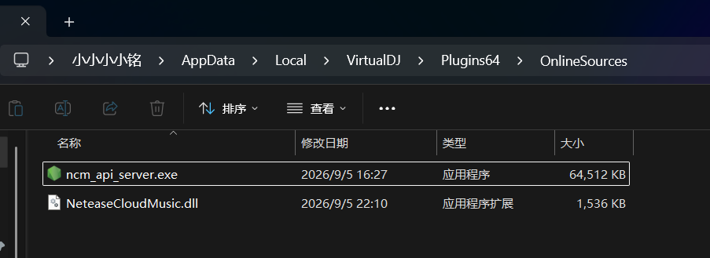

</li>
<li>

启动 VirtualDJ，在浏览窗左侧列表区域找到 **网络曲库**，即可看到 `NeteaseCloudMusic` 字样，则为安装成功

	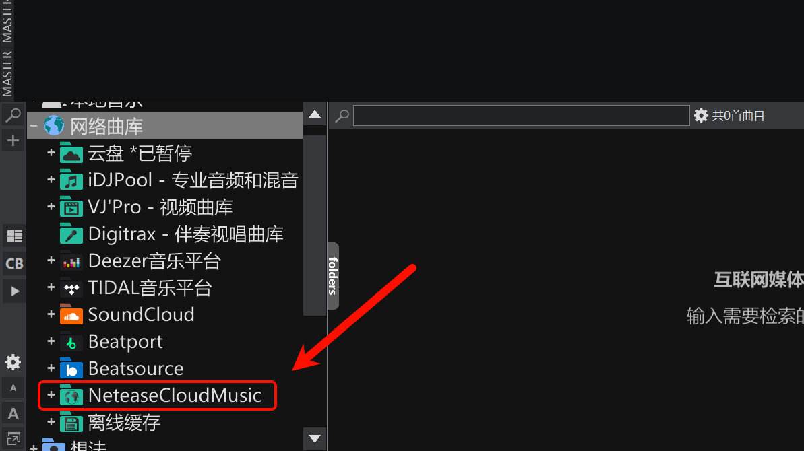

</li>
</ol>

---

## 如何使用 ▶️

<ol>
<li>

启动 VirtualDJ，在 **网络曲库** 中找到 `NeteaseCloudMusic` 项，右键点击，选择 **打开插件设置**

	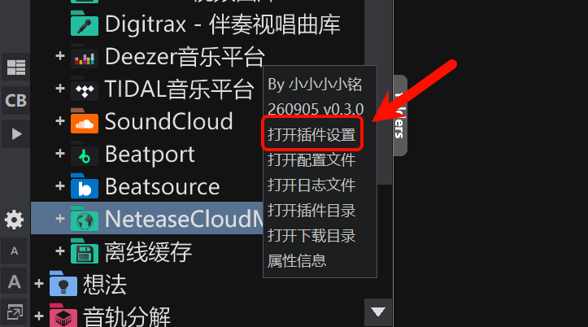

</li>
<li>

在顶部找到 **账户** 部分，点击 **登录**，在浏览器弹出的页面中使用网易云 App 扫码登录

	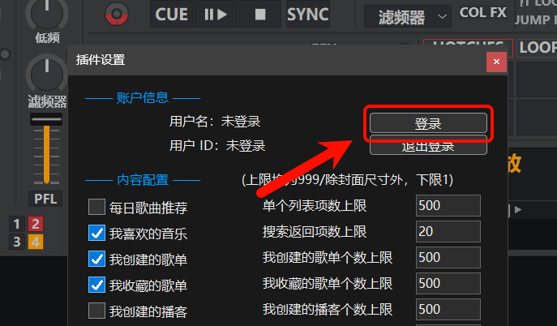

	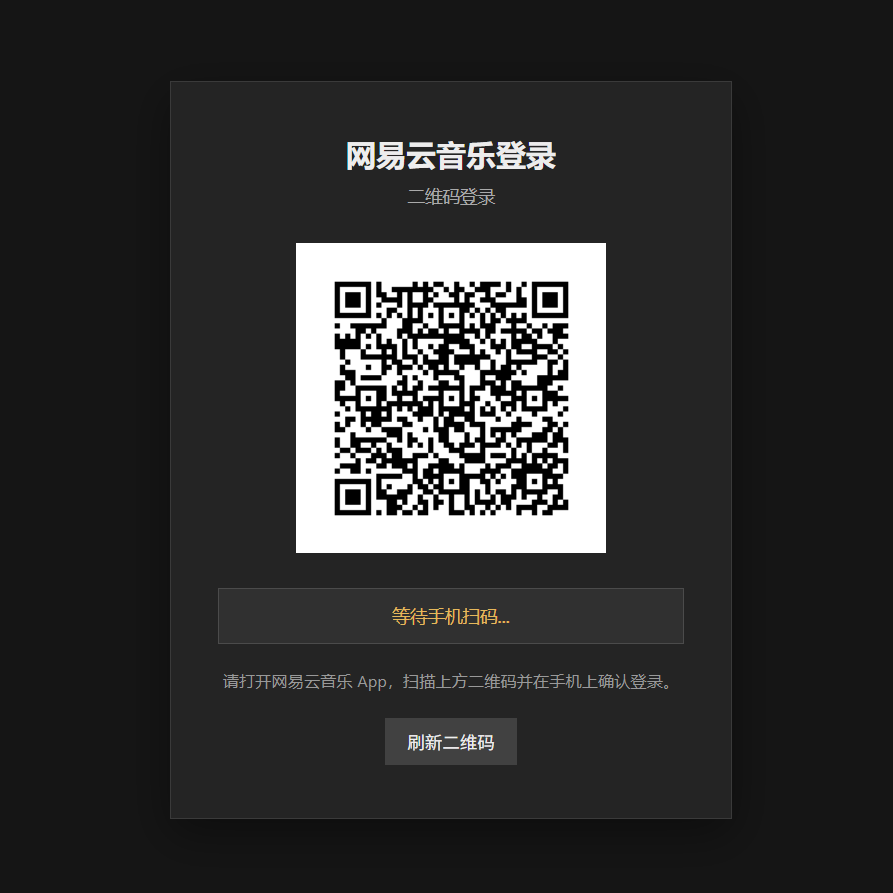

</li>
<li>

登录完成后关闭浏览器，可以在插件设置中看到所登录账户的信息，即为登录成功，即可开始使用

	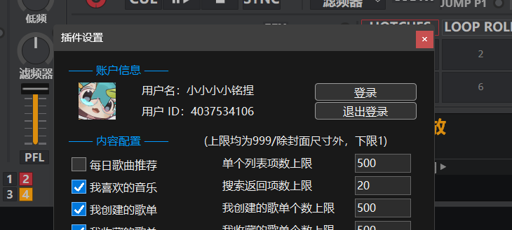

> 无需每次使用均重新登录账号。如果出现获取不到高音质 / 完整内容等问题，则为凭据过期，此时再退出登录、重新扫码登录即可恢复

</li>
<li>

你可以在左侧点击 `NeteaseCloudMusic` 展开列表，即可看到配置好的歌单；选择指定歌单，等待一会即可看到歌单内的内容。如果曲目排序不对，请点击浏览窗列表表头左上角空白区域，确认是按照这个地方排序（有箭头提示），然后点击 `NeteaseCloudMusic` 折叠列表再重新展开即可。请不要使用别的排序方式，这样会打乱列表顺序

	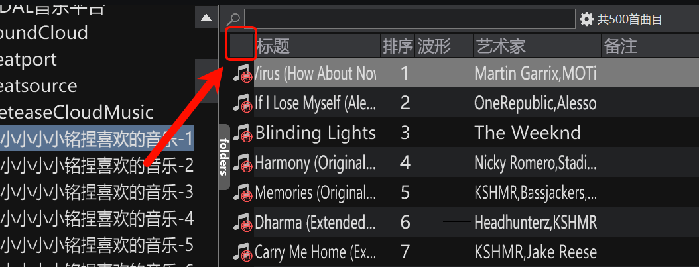

</li>
<li>

可以按需调整插件设置内的配置项，配置均为 **实时生效**

> 变更 **内容 / 数量** 部分配置后，请点击 `NeteaseCloudMusic` 项折叠再展开，即可触发列表刷新

</li>
<li>

点击浏览窗上方输入框附近的 **小齿轮**，按图中指示配置，即可使用搜索功能

	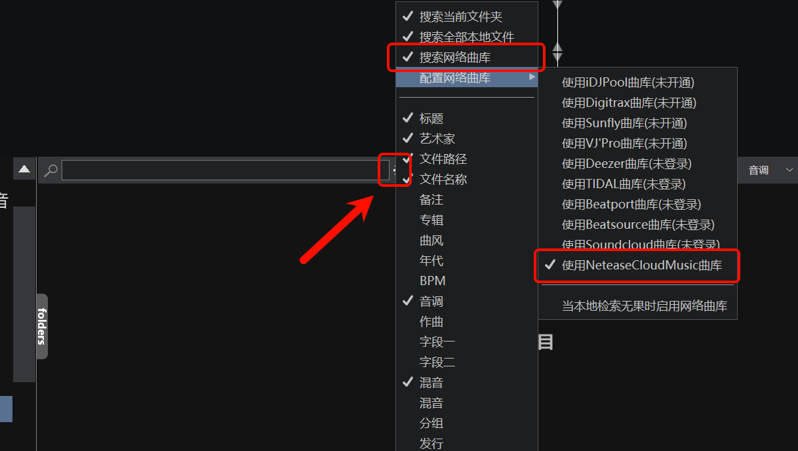

</li>
<li>

左键点击浏览窗列表选中 `NeteaseCloudMusic` 项，在输入框中填写搜索关键词后按下回车即可，支持 **中文搜索**

	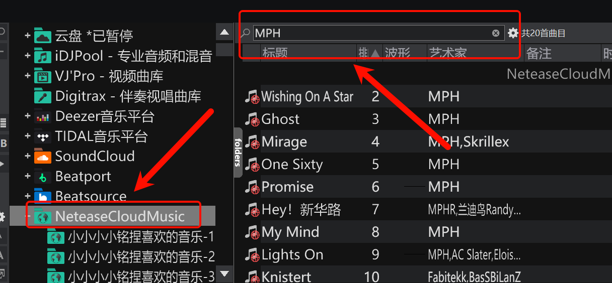

> 可以在插件设置中选择搜索返回的类型，但只能同时选择一个

> 支持直接粘贴分享链接（**不支持短链**），则会自动解析链接内容，链接仅支持这些类型

| 类型 | 路径 |
| --- | --- |
| 单曲 | `/song` |
| 节目 / 声音 | `/program`、`/dj` |
| 电台 / 播客 | `/djradio`、`/radio` |
| 歌单 / 榜单 | `/playlist`、`/toplist`、`/my/m/playlist` |
| 专辑 | `/album` |
| MV | `/mv` |
| 视频 / mlog | `/video`、`/mlog` |

例如 `https://music.163.com/song?id=2610839313`、`https://music.163.com/radio/?id=1003171484`

</li>
<li>

插件设置中启用下载功能后，右键曲目 / 视频即可看到对应下载选项，点击即可下载到设置中指定的路径

	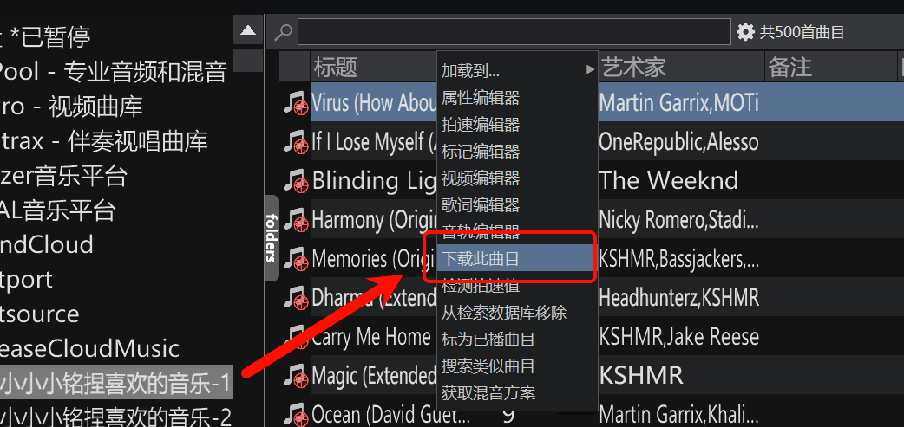

> 选择的音质 / 分辨率均为可获得的上限，如没有则会自动降级返回

> 下载后的文件会自动以 `artist - title.xxx` 命名，如获取出错则使用数字 / 英文唯一 ID 命名

</li>
<li>

如遇到无法获取内容、登录页显示不出来等情况，请检查插件设置下方的 **API 服务状态** 是否在线。如不在线请尝试 **重启 API**，如无法启动请尝试更换端口

	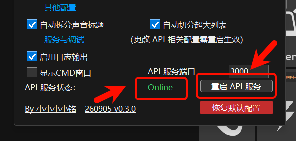

> 变更 API 相关配置需 **重启生效**

</li>
</ol>

---

## 其他内容 📚

	<a href="Docs/md/SETTINGS.md">配置项详细说明</a>
	·
	<a href="Docs/md/FAQ.md">FAQ</a>
	·
	<a href="Docs/md/DEVELOPMENT.md">开发相关</a>

---

### 补充说明 💡

> 由于 API 服务默认自带 **2 分钟缓存**，同一个请求在两分钟之内不会重复返回，所以有时变更列表内条目可能不会很及时，稍等即可

> 所有上限相关配置均为最大值，如没有则自动降级返回

> 搜索的返回条目上限设置如果超过 **100** 或 **20**（类别为声音），可能会延迟返回内容，因为需要分页获取再整合推送

> 如果在 VirtualDJ 中更改了某一曲目的 title / artist，下载功能不会使用修改后的值命名文件，因为无法获取到

---

### BUG 汇报 😨

请详细描述遇到的问题：**具体行为**、是否可以复现，并提供 **VirtualDJ 版本**，以及插件运行目录下的 `log.log` 日志文件

---

### 鸣谢 🙌

[NeteaseCloudMusicAPI Enhanced](https://github.com/neteasecloudmusicapienhanced/api-enhanced)  
非常感谢此项目贡献者们

还有为项目做测试的朋友们

感谢你们的支持

---

### LINK 🔗

	<a href="https://space.bilibili.com/475951038">BILIBILI</a>
	·
	<a href="https://cn.virtualdj.com/wiki/Developers.html">VirtualDJ 开发者文档</a>

---

### 捐赠 🧋

	🥰请我喝奶茶喵 谢谢你喵🥰

	

	<small>哇 你居然看到这里了喵 感谢你看完我辛苦写的 README 喵 偷偷给你发一个小<a href="Docs/skins">彩蛋</a>喵 😋</small>

